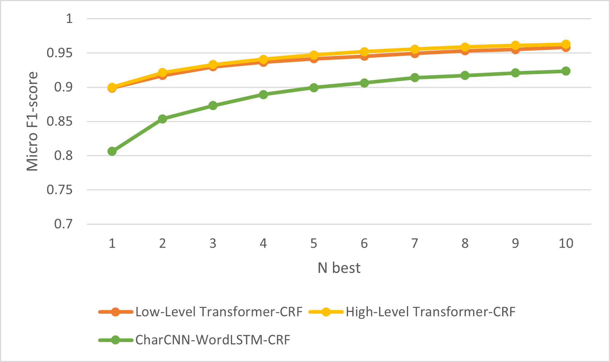
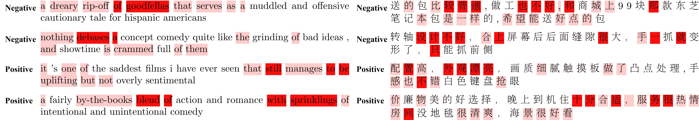

## YATO: Yet Another deep learning based Text analysis Open toolkit


## Quick Links

  - [Introduction](#Introduction)
  - [Getting Started](#getting-started)
  - [Data Format](#Data-Format)
  - [Configuration Preparation](#Configuration-Preparation)
  - [Performance](#Performance)
  - [Add Handcrafted Features](#Add-Handcrafted-Features)
  - [Speed](#Speed)
  - [N best Decoding](#N-best-Decoding)
  - [Text Attention Heatmap Visualization](#Text-Attention-Heatmap-Visualization)
  - [Reproduce Paper Results and Hyperparameter Tuning](#Reproduce-Paper-Results-and-Hyperparameter-Tuning)
  - [Report Issue or Problem](#Report-Issue-or-Problem)
  - [Cite](#Cite)
  - [Future Plan](#Future-Plan)
  - [Update](#Update)

# Introduction

**YATO**, an open-source Python library for text analysis. In particular, **YATO** focuses on sequence labeling and classification tasks, including extensive fundamental NLP tasks such as part-of-speech tagging, chunking, NER, CCG super tagging, sentiment analysis, and sentence classification. **YATO** support both designing specific RNN-based and Transformer-based through user-friendly configuration and integrating the SOTA pre-trained language models such as BERT.

**YATO** is a PyTorch-based framework with flexible choices of input features and output structures.    The design of neural sequence models with **YATO** is fully configurable through a configuration file, which does not require any code work. 

A predecessor version of the framework called ****NCRF++**** has been accepted as a demo paper by ACL 2018. The detailed experimental report and the analysis performed using ****NCRF++**** were accepted as the best paper by COLING 2018.

  iooiWelcome to star this repository! 

## Getting Started

We provide an easy way to use the toolkit **YATO** from PyPI
```bash
pip install yato
```

Or directly install it from the source  code

```
git clone https://github.com/jiesutd/YATO.git
```

The code to train a Model
```python
from yato import YATO
model = YATO(configuration file)
model.train()
```
The code to decode predict file:

```
from yato import YATO
decode_model = YATO(configuration file)
result_dict = decode_model.decode()
```

return dictionary contents following value:

- speed: decode speed
- accuracy: If the decoded file contains annotation results, accuracy means verifying the accuracy
- precision:  If the decoded file contains annotation results, precision means verifying the precision
- recall:  If the decoded file contains annotation results, recall means verifying the recall
- predict_result: predict results
- nbest_predict_score: nbest decode predict scores
- label: The reflection between label and index

## Data Format

* You can refer to the data format in [sample_data](sample_data). 
* **YATO** supports both BIO and BIOES(BMES) tag schemes.  
* Notice that IOB format (***different*** from BIO) is currently not supported, because this tag scheme is old and works worse than other schemes [Reimers and Gurevych, 2017](https://arxiv.org/pdf/1707.06799.pdf). 
* The difference among these three tag schemes is explained in this [paper](https://arxiv.org/pdf/1707.06799.pdf).
* I have written a [script](utils/tagSchemeConverter.py) which converts the tag scheme among IOB/BIO/BIOES. Welcome to have a try. 

## Configuration Preparation 

You can specify the model, optimizer, and decoding through the configuration file:

### Training Configuration

#### Dataloader  
train_dir=the path of the train file    
dev_dir=the path of the validation file   
test_dir=the path of the test file    
model_dir=the path to save model weights  
dset_dir=the path of configuration encode file    

#### Model
use_crf=True/False     
use_char=True/False     
char_seq_feature=GRU/LSTM/CNN/False     
use_word_seq=True/False     
use_word_emb=True/False     
word_emb_dir=The path of word embedding file    
word_seq_feature=GRU/LSTM/CNN/FeedFowrd/False   
low_level_transformer=pretrain language model from huggingface  
low_level_transformer_finetune=True/False  
high_level_transformer=pretrain language model from huggingface  
high_level_transformer_finetune=True/False      
cnn_layer=layer number     
char_hidden_dim=dimension number      
hidden_dim=dimension number     
lstm_layer=layer number      
bilstm=True/False  

### Hyperparameters       
sentence_classification=True/False        
status=train/decode         
dropout=Dropout Rate         
optimizer=SGD/Adagrad/adadelta/rmsprop/adam/adamw    
iteration=epoch number         
batch_size=batch size           
learning_rate=learning rate         
gpu=True/False         
device=cuda:0        
scheduler=get_linear_schedule_with_warmup/get_cosine_schedule_with_warmup            
warmup_step_rate=warmup steo rate         

### Decode Configuration    
status=decode  
raw_dir=The path of decode file    
nbest=0 (NER)/1 (sentence classification)   
decode_dir=The path of decode result file  
load_model_dir=The path of model weights          
sentence_classification=True/False  

## Performance

The results in multiple sequence labeling and sequence classification tasks are better or more comparable than SOTA results for the same structure.

By default, the `LSTM` is a bidirectional LSTM. The `BERT-base` is huggingface's bert-base-uncased. The `RoBERTa-base` is huggingface's roberta-base. The `ELECTRA-base` is huggingface's google/electra-base-discriminator.

#### Results for sequence labeling tasks.
| ID   | Model          | CoNLL2003 | OntoNotes 5.0 | MSRA  | Ontonotes 4.0 | CCG   |
| ---- |----------------|-----------|---------------|-------|---------------|-------|
| 1    | CCNN+WLSTM+CRF | 91.00     | 81.53         | 92.83 | 74.55         | 93.80 |
| 2    | BERT-base      | 91.61     | 84.68         | 95.81 | 80.57         | 96.14 |
| 3    | RoBERTa-base   | 90.23     | 86.28         | 96.02 | 80.94         | 96.16 |
| 4    | ELECTRA-base   | 91.59     | 85.25         | 96.03 | 90.47         | 96.29 |

#### Results for sequence classification tasks.
| ID   | Model      | SST2  | SST5  | ChnSentiCorp |
| ---- |------------|-------|-------|--------------|
| 1    | CCNN+WLSTM | 87.61 | 43.48 | 88.22        |
| 2    | BERT-base  | 93.00 | 53.48 | 95.86        |
| 3    | RoBERTa-base | 92.55 | 51.99 | 96.04        |
| 4    | ELECTRA-base | 94.72 | 55.11 | 95.96        |

For more details you can refer to our papers mentioned below.

We have compared twelve neural sequence labeling models (`{charLSTM, charCNN, None} x {wordLSTM, wordCNN} x {softmax, CRF}`) on three benchmarks (POS, Chunking, NER) under statistical experiments, detail results and comparisons can be found in our COLING 2018 paper [Design Challenges and Misconceptions in Neural Sequence Labeling](https://arxiv.org/abs/1806.04470).

The results based on Pretrain Language Model were published in [YATO: Yet Another deep learning based\ Text analysis Open toolkit]()


## Add Handcrafted Features

**YATO** has integrated several SOTA neural characrter sequence feature extractors: CNN ([Ma .etc, ACL16](http://www.aclweb.org/anthology/P/P16/P16-1101.pdf)), LSTM ([Lample .etc, NAACL16](http://www.aclweb.org/anthology/N/N16/N16-1030.pdf)) and GRU ([Yang .etc, ICLR17](https://arxiv.org/pdf/1703.06345.pdf)). In addition, handcrafted features have been proven important in sequence labeling tasks. **YATO** allows users designing their own features such as Capitalization, POS tag or any other features (grey circles in above figure). Users can configure the self-defined features through configuration file (feature embedding size, pretrained feature embeddings .etc). The sample input data format is given at [train.cappos.bmes](sample_data/train.cappos.bmes), which includes two human-defined features `[POS]` and `[Cap]`. (`[POS]` and `[Cap]` are two examples, you can give your feature any name you want, just follow the format `[xx]` and configure the feature with the same name in configuration file.)
User can configure each feature in configuration file by using 

```Python
feature=[POS] emb_size=20 emb_dir=%your_pretrained_POS_embedding
feature=[Cap] emb_size=20 emb_dir=%your_pretrained_Cap_embedding
```

Feature without pretrained embedding will be randomly initialized.


## Speed

**YATO** is implemented using a fully batch computing approach, making it quite efficient in both model training and decoding. With the help of GPU (Nvidia RTX 2080ti) and large batches, models built with **YATO** can be decoded quickly.


## N best Decoding

Traditional CRF structure decodes only one label sequence with largest probabolities (i.e. 1-best output). While **YATO** can give a large choice, it can decode `n` label sequences with the top `n` probabilities (i.e. n-best output). The nbest decodeing has been supported by several popular **statistical** CRF framework. However to the best of our knowledge, **YATO** is the only and the first toolkit which support nbest decoding in **neural** CRF models. 

In our implementation, the model built in **YATO** can improve the F1-score by 6.6%-14.5% in the CoNLL 2003 NER task when nbest=10.


## Text Attention Heatmap Visualization

**YATO** takes the list of words and the corresponding weights as input and generates Latex code to visualize the attention-based text. the Latex code will generate a separate .pdf visualization file.



You can use following code.
```python
from yato import YATO
from utils import text_attention
model = YATO(decode configuration file)

sample = ["a fairly by-the-books blend of action and romance with sprinklings of intentional and unintentional comedy . ||| 1"]
probsutils, weights_ls = model.attention(input_text=sample)
sentece = "a fairly by-the-books blend of action and romance with sprinklings of intentional and unintentional comedy . "
atten = weights_ls[0].tolist()

text_attention.visualization(sentece, atten[0], tex = 'sample.tex', color='red')
```

## Reproduce Paper Results and Hyperparameter Tuning

To reproduce the results in our COLING 2018 paper, you only need to set the `iteration=1` as `iteration=100` in configuration file `demo.train.config` and configure your file directory in this configuration file. The default configuration file describes the `Char CNN + Word LSTM + CRF` model, you can build your own model by modifing the configuration accordingly. The parameters in this demo configuration file are the same in our paper. (Notice the `Word CNN` related models need slightly different parameters, details can be found in our COLING paper.)

If you want to use this framework in new tasks or datasets, here are some tuning [tips](readme/hyperparameter_tuning.md) by @Victor0118.


## Report Issue or Problem

If you want to report an issue or ask a problem, please attach the following materials if necessary. With these information, I can give fast and accurate discussion and suggestion. 

* `log file` 
* `config file` 
* `sample data` 


## Cite

If you use **NCRF++** in your paper, please cite our [ACL demo paper](https://arxiv.org/abs/1806.05626):

    @inproceedings{yang2018ncrf,  
     title={**YATO**: An Open-source Neural Sequence Labeling Toolkit},  
     author={Yang, Jie and Zhang, Yue},  
     booktitle={Proceedings of the 56th Annual Meeting of the Association for Computational Linguistics},
     Url = {http://aclweb.org/anthology/P18-4013},
     year={2018}  
    }


If you use experiments results and analysis of **NCRF++**, please cite our [COLING paper](https://arxiv.org/abs/1806.04470):

    @inproceedings{yang2018design,  
     title={Design Challenges and Misconceptions in Neural Sequence Labeling},  
     author={Yang, Jie and Liang, Shuailong and Zhang, Yue},  
     booktitle={Proceedings of the 27th International Conference on Computational Linguistics (COLING)},
     Url = {http://aclweb.org/anthology/C18-1327},
     year={2018}  
    }

## Future Plan 

* Document classification (working)
* Support API usage
* Upload trained model on Word Segmentation/POS tagging/NER

## Updates

* 2022-May-14  YATO, init version
* 2020-Mar-06, dev version, sentence classification, framework change, model saved in one file. 
* 2018-Dec-17, **YATO** v0.2, support PyTorch 1.0
* 2018-Mar-30, **YATO** v0.1, initial version
* 2018-Jan-06, add result comparison.
* 2018-Jan-02, support character feature selection. 
* 2017-Dec-06, init version
